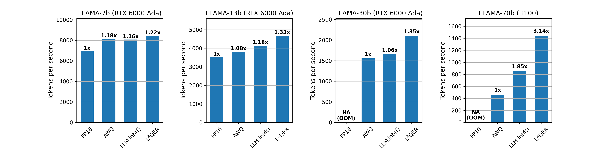

# LQER Rebuttal

This repo serves as the anonymous repo for LQER rebuttal, including GPU performance results and AlpacaEval results.

## GPU Perf

- Please refer to `./gpu_perf_results` for detailed results.
- `./gpu_perf.png` is the barplot of throughput measured in tokens per second.
- We measured prefilling throughput to remove the bias of KV cache implementation as different PTQ implementation may use different KV cache implementaion
- We sweep batch size and sequence length on RTX6000 Ada and H100. 

## Alpaca-Eval Results (Still Updating)

- We use GPT4 Turbo as evaluator

| Model | Generation vs Reference | Length-controlled Win Rate | Win Rate | Std Error | 
| ---   | :---                    | :---:                      | :---:    | :---:     |
| LLaMA-2-7B-chat  | $L^2QER$ vs AWQ | 56.06 | 55.32 | 1.53 |
| LLaMA-2-13B-chat | $L^2QER$ vs AWQ | 52.90 | 52.51 | 1.48 |

- Please refer to `./alpaca_eval_results` for detailed raw results of AlpacaEval
